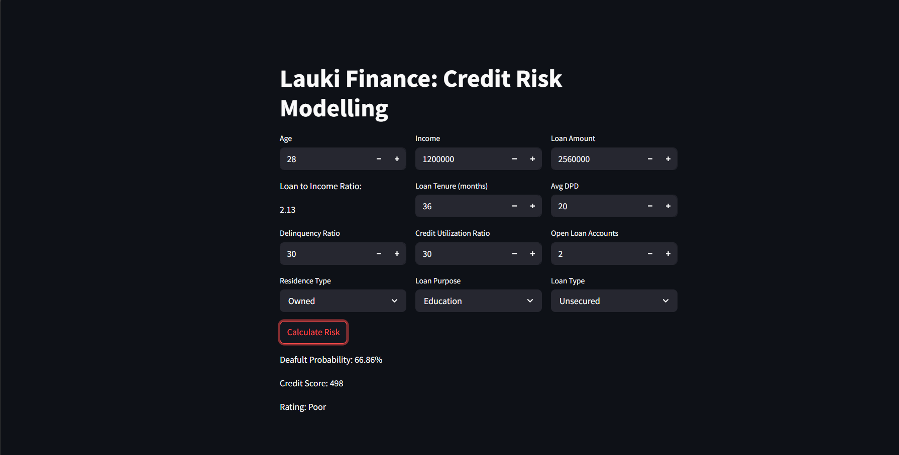

# 💼 Lauki Finance: Credit Risk Modelling

This project is a **credit risk prediction system** developed for Lauki Finance. It uses machine learning to evaluate borrower data and predict the probability of credit default. The application is built with **Streamlit** to provide a user-friendly interface for real-time risk analysis.

---



---

## 📌 Key Features

- ✅ Predicts **Default Probability**, **Credit Score**, and **Rating (Good/Fair/Poor)**
- ✅ Uses financial ratios like Loan-to-Income, Credit Utilization, and Delinquency Ratio
- ✅ Interactive frontend built using **Streamlit**
- ✅ Model and preprocessing pipeline saved and loaded from artifacts
- ✅ Quick and accurate credit risk scoring

---

## ⚙️ Tech Stack

| Layer        | Tools & Libraries            |
|--------------|------------------------------|
| Frontend     | Streamlit                    |
| Backend      | Python                       |
| ML Libraries | Scikit-learn, NumPy, Pandas  |
| Deployment   | Local / Streamlit Sharing    |

---

## 🧪 Sample Output

- **Default Probability**: 66.86%
- **Credit Score**: 498
- **Rating**: Poor

---

## 🗂️ Project Structure

```
credit-risk-modelling/
├── app/
│   ├── main.py                # Main Streamlit app
│   └── prediction_helper.py   # Preprocessing and prediction logic
├── artifacts/                 # Contains model, scaler, and feature info
├── dataset/                   # Sample datasets (if used)
├── credit_risk_model.ipynb    # Jupyter notebook for training and EDA
├── requirements.txt           # Dependencies
└── README.md
```

---

## 🚀 Getting Started

### 1. Clone the repository

```bash
git clone https://github.com/your-username/credit-risk-modelling.git
cd credit-risk-modelling
```

### 2. Create virtual environment and activate

```bash
python -m venv venv
source venv/bin/activate  # On Windows: venv\Scripts\activate
```

### 3. Install dependencies

```bash
pip install -r requirements.txt
```

### 4. Run the Streamlit app

```bash
streamlit run app/main.py
```

---


## 📬 Contact

If you have any questions or suggestions, feel free to reach out:

📧 Email: [sanjaykumar111008@gmail.com](mailto:sanjaykumar111008@gmail.com)
